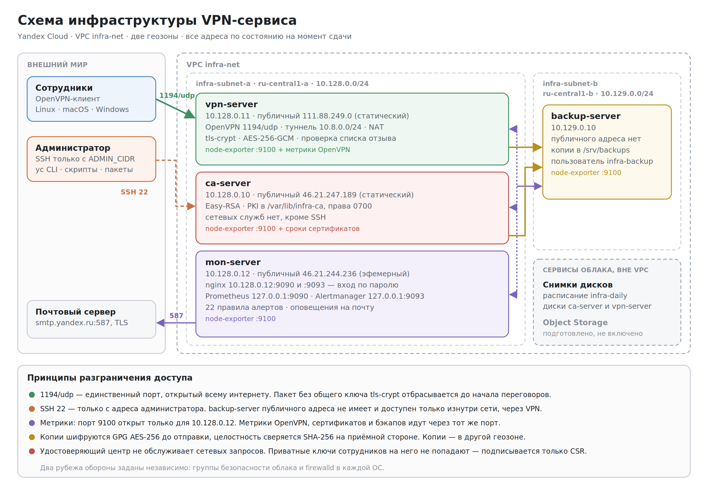

# Инфраструктура VPN-сервиса

Финальная работа по курсу «Старт в DevOps: системное администрирование для начинающих».

Облако — Yandex Cloud, фаервол — firewalld, ОС — Ubuntu 20.04 LTS.

---

## Задача

Небольшая компания консультирует по UI/UX-дизайну. Сотрудники работают удалённо, часто через публичный Wi-Fi, а IT-инфраструктуры нет. Требовалось построить её основу: VPN как единственную точку входа во внутреннюю сеть с доступом по сертификатам, мониторинг, резервное копирование и документацию, — и сделать развёртывание воспроизводимым.

## Что построено

- **Четыре сервера** в собственной сети, в двух геозонах: удостоверяющий центр, VPN, мониторинг, хранилище копий.
- **Шесть deb-пакетов**, проходящих lintian без замечаний, и два десятка bash-скриптов, проходящих shellcheck.
- **22 правила алертов** с оповещением на почту и подавлением вторичных срабатываний.
- **Шифрованное резервное копирование** с проверкой контрольной суммы и регулярной проверкой восстановления.
- **Пять документов**: два руководства, проектирование мониторинга, политика резервного копирования, план развития.

---

## Архитектура



Три решения, на которых держится схема.

**Приватный ключ не покидает машину владельца.** Сотрудник создаёт ключ и запрос на сертификат у себя, присылает только запрос, а файл подключения собирает локально. Компрометация удостоверяющего центра не раскрывает ни одного клиентского ключа — их там нет.

**Два независимых рубежа обороны.** Правила доступа заданы и в группах безопасности облака, и в firewalld на каждой машине. Ошибка в одном слое не раскрывает сервер целиком.

**Один канал метрик на машину.** Инфраструктурные метрики, сроки сертификатов, состояние OpenVPN и результаты копирования идут через единственный порт 9100. Собственные метрики пишутся в каталог textfile-коллектора — без лишних демонов, портов и правил фаервола.

---

## Материалы для проверки

Пункты — в порядке списка материалов из задания.

| № | Материал | Где |
|---|---|---|
| 1 | Скрипты и пакеты удостоверяющего центра и защиты ВМ | [`scripts/cloud`](scripts/cloud/), [`scripts/ca`](scripts/ca/); пакеты [`infra-common`](packages/infra-common/), [`infra-hardening`](packages/infra-hardening/), [`infra-ca-config`](packages/infra-ca-config/) |
| 2 | Скрипты и пакеты VPN-сервера и обслуживания клиентов | [`scripts/vpn`](scripts/vpn/), [`scripts/client`](scripts/client/), [`scripts/admin`](scripts/admin/); пакет [`infra-vpn-config`](packages/infra-vpn-config/) |
| 3 | Скриншот подключения к VPN со сменой адреса | [`docs/screenshots`](docs/screenshots/) |
| 4 | Проектирование мониторинга | [`docs/monitoring-design.md`](docs/monitoring-design.md) |
| 5 | Скрипты и пакеты мониторинга | [`scripts/monitoring`](scripts/monitoring/); пакеты [`infra-monitoring-config`](packages/infra-monitoring-config/), [`infra-node-metrics`](packages/infra-node-metrics/) |
| 6 | Алерты и история метрик в Prometheus | [`docs/screenshots`](docs/screenshots/) |
| 7 | Описание резервного копирования | [`docs/backup-policy.md`](docs/backup-policy.md) |
| 8 | Скрипты резервного копирования и механизмы облака | [`scripts/backup`](scripts/backup/); снимки дисков — [`docs/screenshots`](docs/screenshots/) |
| 9 | Руководство пользователя VPN | [`docs/user-guide.md`](docs/user-guide.md) |
| 10 | Схема инфраструктуры | [`docs/diagrams/infrastructure.png`](docs/diagrams/infrastructure.png) |
| 11 | Схема потоков данных | [`docs/diagrams/dataflow.png`](docs/diagrams/dataflow.png) |
| 12 | Руководство системного администратора | [`docs/admin-guide.md`](docs/admin-guide.md) |
| 13 | План развития инфраструктуры | [`docs/roadmap.md`](docs/roadmap.md) |

Каждый документ лежит в двух форматах. Markdown читается прямо на GitHub вместе со схемами, `.docx` — для загрузки в Google Docs.

Начать удобнее всего с [руководства администратора](docs/admin-guide.md): в нём описана вся система, развёртывание каждого сервера с нуля и все алерты.

---

## Структура репозитория

```
├── scripts/
│   ├── project.env       единственное место с адресами и именами
│   ├── lib/common.sh     общая библиотека: журнал, проверки, коды выхода
│   ├── cloud/            сеть, группы безопасности, виртуальные машины
│   ├── ca/               развёртывание центра и подпись запросов
│   ├── vpn/              ключ, запрос и настройка VPN-сервера
│   ├── client/           машина сотрудника: запрос и сборка файла подключения
│   ├── admin/            выдача сертификатов одной командой
│   ├── monitoring/       развёртывание Prometheus и Alertmanager
│   ├── backup/           копирование, восстановление, проверка копий
│   └── test/             проверка состояния и пакетов на чистой ВМ
├── packages/             исходники deb-пакетов
├── dist/                 собранные пакеты
└── docs/                 руководства, схемы, проектные документы
```

## Пакеты

| Пакет | Версия | Назначение |
|---|---|---|
| `infra-common` | 1.0.1 | Библиотека скриптов и параметры инфраструктуры |
| `infra-hardening` | 1.0.0 | SSH только по ключу, параметры ядра, автообновления |
| `infra-ca-config` | 1.0.1 | Команды `infra-ca-init` и `infra-ca-sign`, зависит от `easy-rsa` |
| `infra-vpn-config` | 1.0.3 | Конфигурация OpenVPN, сборка комплектов, сборщик метрик OpenVPN |
| `infra-monitoring-config` | 1.0.5 | Конфигурация Prometheus и Alertmanager, 22 правила алертов |
| `infra-node-metrics` | 1.0.2 | node-exporter и метрики сроков сертификатов на каждой ВМ |

Каждое изменение записано в `debian/changelog` пакета — с причиной, а не только с перечнем правок.

---

## Как развернуть

Полная процедура с проверкой после каждого шага — в разделе 4 [руководства администратора](docs/admin-guide.md). Кратко:

```bash
./scripts/cloud/10-create-network.sh          # сеть, подсети, статические адреса
./scripts/cloud/20-create-security-groups.sh  # группы безопасности по ролям
./scripts/cloud/30-create-vm.sh ca            # затем vpn, mon, backup
./scripts/admin/issue-server-cert.sh          # сертификат VPN-сервера одной командой
./scripts/admin/issue-client-cert.sh ivanov ivanov.req
```

Перед запуском замените в `scripts/project.env` значение `ADMIN_CIDR` на свой адрес. В репозитории стоит `0.0.0.0/0` намеренно: публиковать собственный адрес в открытом доступе незачем.

## Проверка качества

```bash
shellcheck -x -S warning scripts/*/*.sh packages/*/usr/sbin/*
lintian dist/*.deb
promtool check rules packages/infra-monitoring-config/etc/prometheus/rules/*.yml
./scripts/test/test-on-fresh-vm.sh dist
```

Скрипты проходят shellcheck, пакеты — lintian без замечаний, правила алертов — promtool. Последняя команда создаёт временную ВМ, ставит пакеты на чистую систему, проверяет зависимости, коды возврата, права, повторную установку и полную очистку, затем удаляет машину.

---

## Что выяснилось на практике

Многое из этого не ловится ни одной проверкой кода — только на живой инфраструктуре. Подробности — в разделе 8 руководства администратора.

- **Версии в дистрибутиве старше, чем кажется.** Prometheus 2.15 и Alertmanager 0.15.3 из Ubuntu 20.04 не понимают современной конфигурации: встроенную аутентификацию заменил обратный прокси.
- **Пакет не должен перехватывать чужие файлы.** Дважды это ломало установку. Правильный путь — drop-in для systemd.
- **dpkg размещает файлы в два приёма.** Файлы из `/usr/lib` появляются при распаковке, конфигурационные из `/etc` — позже. Служба, стартующая между этими моментами, падает.
- **Алерт по метрике молчит, когда метрики нет.** Копирование не работало 17 часов без единого оповещения. Закрыто правилом на `absent()`.
- **`2>/dev/null || true` прячет не ту ошибку.** Системный пользователь `backup` уже существовал, и ключи оказались не в том каталоге.
- **Открытый всему интернету SSH мешает не теоретически.** Сканирующие боты занимали лимит соединений и роняли подключения администратора.
- **Алерт без действия хуже отсутствия алерта.** Сбор состояния всех служб дал пять ложных тревог по служебным юнитам облака.

Дальнейшее развитие, выросшее из этих наблюдений, описано в [плане развития](docs/roadmap.md).
