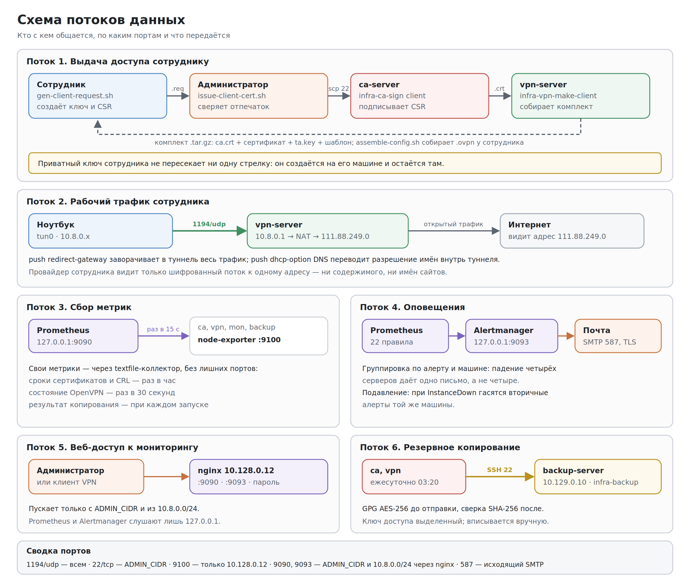

# Руководство системного администратора

Описание инфраструктуры VPN-сервиса: что развёрнуто, как это воссоздать с нуля, как обслуживать и что делать при сбоях. Документ отражает фактическое состояние системы на момент сдачи.

---

## 1. Система в целом

### Назначение

VPN-сервис для удалённых сотрудников компании. Решает две задачи: шифрует трафик сотрудников в недоверенных сетях и служит единственной точкой входа во внутреннюю инфраструктуру. Доступ выдаётся по сертификатам собственного удостоверяющего центра.

### Размещение

| Параметр | Значение |
|---|---|
| Облачный провайдер | Yandex Cloud |
| Каталог | `b1ghtvbha1icjf9f7i4r` |
| Сеть | `infra-net` — собственная, не `default` |
| Зоны | `ru-central1-a` — основная, `ru-central1-b` — хранилище копий |
| ОС на всех машинах | Ubuntu 20.04 LTS |

Имя облака и активный профиль: `yc config list` и `yc resource-manager cloud list`.

Собственная сеть выбрана намеренно: в сети `default` оказывается любая машина этого облака, включая чужие эксперименты. Своя сеть даёт изолированный периметр и фиксированную адресацию, на которую опираются правила фаервола и конфигурация мониторинга.

### Учётные записи

| Учётная запись | Где | Кто пользуется | Как входит |
|---|---|---|---|
| Yandex ID администратора | Консоль облака, `yc` CLI | Администратор | Федеративный вход |
| `yc-user` | Все ВМ | Администратор | Только SSH-ключ, пароля нет |
| `root` | Все ВМ | Никто напрямую | Вход запрещён, только через `sudo` |
| `infra-backup` | backup-server | Задачи копирования с ca и vpn | Выделенные ключи этих машин |
| `prometheus` | mon-server | Службы мониторинга | Системная, без входа |
| `www-data` | mon-server | nginx | Системная, без входа |
| `nobody` | vpn-server | OpenVPN после понижения привилегий | Системная, без входа |

Сейчас доступ ко всему есть у одного администратора. При появлении второго ему заводится собственный SSH-ключ, а не передаётся существующий.

### Секреты и где они хранятся

| Секрет | Где хранится | Последствия утраты |
|---|---|---|
| Парольная фраза ключа центра | Менеджер паролей | Невозможно выпустить или отозвать ни одного сертификата |
| Фраза шифрования копий | Менеджер паролей; `/etc/infra-backup/passphrase` на ca и vpn, права 0600 | Все копии становятся бесполезны |
| Пароль веб-интерфейса мониторинга | Менеджер паролей; хеш bcrypt в `/etc/nginx/infra-monitoring.htpasswd` | Задать новый, см. раздел 7 |
| Пароль почтового ящика для алертов | `/etc/prometheus/infra-alertmanager.yml`, права 0640 | Письма перестают уходить |
| Ключ `ta.key` | vpn-server и комплекты сотрудников | Перевыпуск и раздача всем |
| SSH-ключ администратора | Рабочая машина администратора | Доступ через серийную консоль облака |

---

## 2. Адреса и ссылки

### Серверы

| Сервер | Внутренний | Публичный | Зона | Открытые порты |
|---|---|---|---|---|
| `ca-server` | 10.128.0.10 | 46.21.247.189, статический | ru-central1-a | 22 |
| `vpn-server` | 10.128.0.11 | 111.88.249.0, статический | ru-central1-a | 22, 1194/udp, 9100 |
| `mon-server` | 10.128.0.12 | 46.21.244.236, **эфемерный** | ru-central1-a | 22, 9090, 9093, 9100 |
| `backup-server` | 10.129.0.10 | нет | ru-central1-b | 22, 9100 — только изнутри сети |
| Подсеть VPN-клиентов | 10.8.0.0/24 | — | — | — |

Адрес `mon-server` меняется при остановке машины: квота на статические адреса невелика, а веб-интерфейс мониторинга открывается через VPN по внутреннему адресу. Текущий адрес: `yc compute instance list`.

### Веб-интерфейсы

| Сервис | Через VPN | С адреса администратора |
|---|---|---|
| Prometheus | http://10.128.0.12:9090 | http://46.21.244.236:9090 |
| Alertmanager | http://10.128.0.12:9093 | http://46.21.244.236:9093 |

Пользователь `admin`, пароль — в менеджере паролей.

### Полезные ссылки

- Репозиторий со скриптами и пакетами: https://github.com/ryzhkovtosha-cmd/DevOps_Project_SysAdmin
- Консоль облака: https://console.yandex.cloud
- Почта для обращений сотрудников: sysadmin@company.ru

---

## 3. Компоненты и их взаимодействие


**ca-server** — удостоверяющий центр. Выпускает и отзывает сертификаты. Не обслуживает ни одного сетевого запроса, кроме SSH. Самая закрытая машина инфраструктуры.

**vpn-server** — единственная точка входа. Принимает подключения на 1194/udp, выполняет NAT для клиентского трафика, собирает комплекты для новых сотрудников.

**mon-server** — Prometheus и Alertmanager за обратным прокси nginx. Опрашивает экспортёры, оценивает правила, отправляет письма.

**backup-server** — хранилище копий в другой геозоне. Публичного адреса нет принципиально.



### Три решения, на которых держится схема

**Приватный ключ не покидает машину владельца.** Сотрудник создаёт ключ и запрос у себя, присылает только запрос, итоговый файл подключения собирает локально. Компрометация удостоверяющего центра не раскрывает ни одного ключа сотрудника — их там нет.

**Два независимых рубежа обороны.** Правила доступа заданы и в группах безопасности облака, и в firewalld внутри каждой машины. Ошибка в одном слое не раскрывает сервер целиком.

**Один канал сбора метрик на машину.** Всё — инфраструктурные метрики, сроки сертификатов, состояние OpenVPN, результаты бэкапов — идёт через порт 9100. Собственные метрики пишутся в каталог textfile-коллектора node-exporter. Нет лишних демонов, портов и правил фаервола.

---

## 4. Развёртывание с нуля по шагам

Порядок важен: каждый следующий шаг опирается на предыдущий. Все скрипты и пакеты — в репозитории, собранные пакеты — в каталоге `dist/`.

### 4.1. Рабочее место администратора

```bash
git clone https://github.com/ryzhkovtosha-cmd/DevOps_Project_SysAdmin.git
cd DevOps_Project_SysAdmin

# SSH-ключ, если его ещё нет
ssh-keygen -t ed25519 -C "infra-admin"

# агент, чтобы не вводить парольную фразу ключа на каждую команду
eval "$(ssh-agent -s)"
ssh-add ~/.ssh/id_ed25519
```

В `scripts/project.env` замените `ADMIN_CIDR` на свой адрес. В репозитории он хранится как `0.0.0.0/0` намеренно — публиковать свой адрес в открытом доступе незачем.

```bash
curl -s ifconfig.me; echo
nano scripts/project.env     # ADMIN_CIDR="<адрес>/32"
```

### 4.2. Сеть

```bash
./scripts/cloud/10-create-network.sh
./scripts/cloud/20-create-security-groups.sh
```

Первый скрипт создаёт сеть, две подсети и резервирует два статических адреса — для ca-server и vpn-server. Второй создаёт четыре группы безопасности по ролям. Оба идемпотентны: повторный запуск ничего не пересоздаёт.

**Проверка:**

```bash
yc vpc network list
yc vpc security-group list
yc vpc address list
```

### 4.3. Удостоверяющий центр

```bash
./scripts/cloud/30-create-vm.sh ca
CA_IP=$(yc compute instance get --name ca-server --format json | grep -oP '"address":\s*"\K[0-9.]+' | tail -1)

scp dist/infra-common_*.deb dist/infra-hardening_*.deb \
    dist/infra-ca-config_*.deb dist/infra-node-metrics_*.deb yc-user@$CA_IP:~/
scp -r scripts yc-user@$CA_IP:~/
ssh yc-user@$CA_IP 'chmod +x ~/scripts/*/*.sh && sudo apt-get update -qq && sudo apt-get install -y ./infra-*.deb'

ssh -t yc-user@$CA_IP 'sudo infra-ca-init'
```

`infra-ca-init` интерактивна: спросит парольную фразу приватного ключа центра. Сразу запишите её в менеджер паролей.

**Проверка:** `ssh yc-user@$CA_IP 'sudo ~/scripts/test/verify.sh ca'`

### 4.4. VPN-сервер

```bash
./scripts/cloud/30-create-vm.sh vpn
VPN_IP=$(yc compute instance get --name vpn-server --format json | grep -oP '"address":\s*"\K[0-9.]+' | tail -1)

scp dist/infra-common_*.deb dist/infra-hardening_*.deb \
    dist/infra-vpn-config_*.deb dist/infra-node-metrics_*.deb yc-user@$VPN_IP:~/
scp -r scripts yc-user@$VPN_IP:~/
ssh yc-user@$VPN_IP 'chmod +x ~/scripts/*/*.sh && sudo apt-get update -qq && sudo apt-get install -y ./infra-*.deb'
```

Пакет намеренно не запускает OpenVPN — сертификатов ещё нет. Сертификат выпускается **с рабочего места администратора**, одной командой:

```bash
./scripts/admin/issue-server-cert.sh
```

Скрипт создаёт ключ и запрос на VPN-сервере, забирает только запрос, подписывает его на центре, обновляет список отзыва, проверяет цепочку доверия и запускает службу. Парольную фразу центра спросит один раз.

**Проверка:** `ssh yc-user@$VPN_IP 'sudo ~/scripts/test/verify.sh vpn'` — все проверки зелёные, включая наличие `redirect-gateway` и доступность списка отзыва пользователю `nobody`.

### 4.5. Сервер мониторинга

```bash
./scripts/cloud/30-create-vm.sh mon
MON=$(yc compute instance get --name mon-server --format json | grep -oP '"address":\s*"\K[0-9.]+' | tail -1)

# доступ к серийной консоли — на случай, если SSH откажет
yc compute instance add-metadata --name mon-server --metadata serial-port-enable=1
yc compute instance update --name mon-server --serial-port-settings ssh-authorization=INSTANCE_METADATA

scp dist/infra-common_*.deb dist/infra-hardening_*.deb \
    dist/infra-monitoring-config_*.deb dist/infra-node-metrics_*.deb yc-user@$MON:~/
scp -r scripts yc-user@$MON:~/
ssh yc-user@$MON 'chmod +x ~/scripts/*/*.sh && sudo apt-get update -qq && sudo apt-get install -y ./infra-*.deb'

ssh -t yc-user@$MON 'sudo ~/scripts/monitoring/setup-prometheus.sh'
```

Скрипт спросит пароль веб-интерфейсов и пароль почтового ящика. Для Яндекс-почты нужен **пароль приложения**, а не пароль от аккаунта.

На ca-server и vpn-server экспортёр уже стоит — он входит в пакеты, установленные выше.

**Проверка:** `ssh yc-user@$MON 'sudo ~/scripts/test/verify.sh mon'` — пять целей из пяти отвечают, внешний доступ возвращает HTTP 401.

### 4.6. Сервер резервных копий

У этой машины нет публичного адреса. Работать с ней можно только **через VPN** — поднимите туннель.

```bash
./scripts/cloud/30-create-vm.sh backup
sudo openvpn --config ~/.infra-vpn/<имя>.ovpn &
sleep 10

scp dist/infra-common_*.deb dist/infra-hardening_*.deb dist/infra-node-metrics_*.deb yc-user@10.129.0.10:~/
ssh yc-user@10.129.0.10 'sudo apt-get update -qq && sudo apt-get install -y ./infra-*.deb'
ssh yc-user@10.129.0.10 'sudo useradd -m -d /srv/backups -s /bin/bash infra-backup \
  && sudo mkdir -p /srv/backups/.ssh && sudo chmod 700 /srv/backups /srv/backups/.ssh \
  && sudo chown -R infra-backup:infra-backup /srv/backups'

sudo pkill openvpn
```

Пользователь называется `infra-backup`, а не `backup`: в Ubuntu системный пользователь `backup` уже существует — с домашним каталогом `/var/backups` и запретом входа.

Затем на источниках копий, по публичным адресам — **туннель опущен**:

```bash
ssh -t yc-user@$CA_IP  'sudo ~/scripts/backup/setup-backup.sh ca'
ssh -t yc-user@$VPN_IP 'sudo ~/scripts/backup/setup-backup.sh vpn'
```

Парольная фраза шифрования — одна и та же на обеих машинах. Скрипт напечатает публичные ключи — впишите их в `/srv/backups/.ssh/authorized_keys` на backup-server, снова подняв туннель. Скрипт намеренно не делает этого сам: машина-источник не должна иметь права записи в список ключей хранилища.

**Проверка:**

```bash
ssh -t yc-user@$CA_IP 'sudo systemctl start infra-backup.service'
ssh -t yc-user@$CA_IP 'sudo infra-restore --verify ca'
```

### 4.7. Снимки дисков

```bash
yc compute snapshot-schedule create --name infra-daily --expression "0 2 * * *" --snapshot-count 7
for vm in ca-server vpn-server; do
  DISK=$(yc compute instance get --name $vm --format json | grep -oP '"disk_id":\s*"\K[^"]+' | head -1)
  yc compute snapshot-schedule add-disks --name infra-daily --disk-id "$DISK"
done
```

### 4.8. Проверка пакетов на чистой машине

Перед установкой новой версии пакета на рабочий сервер:

```bash
./scripts/test/test-on-fresh-vm.sh dist
```

Скрипт создаёт временную ВМ, ставит пакеты на чистую систему, проверяет зависимости, коды возврата, права, повторную установку и полную очистку, затем удаляет машину. Проверять пакеты на рабочем сервере бессмысленно: там уже созданы каталоги и разрешены зависимости, и половина проблем не проявится.

---

## 5. Повседневные операции

### Два режима работы

| Режим | Доступные адреса | Недоступно |
|---|---|---|
| Туннель опущен | Публичные: ca, vpn, mon | backup-server |
| Туннель поднят | Внутренние: 10.128.0.x, 10.129.0.10 | Публичные адреса всех машин |

Смешивать нельзя. При поднятом туннеле трафик выходит в интернет с адреса VPN-сервера, которого нет в правилах SSH, — подключения к публичным адресам обрываются. Проверить режим: `curl -s ifconfig.me` — при поднятом туннеле ответит `111.88.249.0`.

### Выдать доступ сотруднику

1. Сотрудник выполняет шаги 1–4 руководства пользователя и присылает файл `<имя>.req` и отпечаток.
2. Администратор, с рабочего места:

```bash
./scripts/admin/issue-client-cert.sh <имя> ~/Downloads/<имя>.req
```

Скрипт покажет отпечаток и потребует подтверждения. **Сверьте его с присланным** — это единственная защита от подмены запроса. Затем он подпишет запрос на центре, соберёт комплект на VPN-сервере и положит `<имя>-bundle.tar.gz` в текущий каталог.

3. Отправьте архив сотруднику. Без его секретного ключа архив бесполезен, поэтому обычная почта допустима.

### Отозвать доступ

При увольнении, утере устройства или подозрении на компрометацию. На центре:

```bash
ssh -t yc-user@$CA_IP 'sudo sh -c "cd /var/lib/infra-ca \
  && EASYRSA=/var/lib/infra-ca EASYRSA_PKI=/var/lib/infra-ca/pki ./easyrsa revoke <имя> \
  && EASYRSA=/var/lib/infra-ca EASYRSA_PKI=/var/lib/infra-ca/pki ./easyrsa gen-crl"'
ssh yc-user@$CA_IP 'sudo cat /var/lib/infra-ca/pki/crl.pem' > /tmp/crl.pem
```

На VPN-сервере:

```bash
scp /tmp/crl.pem yc-user@$VPN_IP:/tmp/
ssh yc-user@$VPN_IP 'sudo install -m 0644 /tmp/crl.pem /etc/openvpn/crl.pem && sudo systemctl restart openvpn-server@server'
```

Список отзыва лежит в `/etc/openvpn`, а не в `/etc/openvpn/server`: OpenVPN перечитывает его при каждом подключении уже от имени `nobody`, а каталог `server` закрыт правами 0700.

**Проверка:** `ssh yc-user@$VPN_IP 'sudo grep <имя> /var/log/openvpn/openvpn-status.log'` — пусто.

### Кто подключён

```bash
ssh yc-user@$VPN_IP 'sudo cat /var/log/openvpn/openvpn-status.log'
```

Или в Prometheus: `openvpn_server_connected_clients`.

### Обновление конфигурации

Конфигурация меняется в исходнике пакета, а не на сервере — иначе изменение потеряется при следующем развёртывании. Поднимите версию в `debian/changelog`, соберите пакет, проверьте на чистой машине и установите:

```bash
sudo apt-get install -y -o Dpkg::Options::="--force-confold" ./<пакет>_<версия>_all.deb
```

Флаг `--force-confold` сохраняет локально изменённые конфигурационные файлы. Это важно для `infra-alertmanager.yml`, куда скрипт настройки вписал пароль SMTP: без флага его может заменить версия из пакета с заглушкой.

---

## 6. Резервное копирование

### Что копируется

| Задача | Источник | Когда | Хранение |
|---|---|---|---|
| `ca` | PKI удостоверяющего центра | ежесуточно 03:20 | 14 суточных + 8 недельных |
| `vpn` | Ключи, сертификаты и конфигурация VPN | ежесуточно 03:20 | 14 суточных + 8 недельных |

Скрипты и пакеты хранятся в репозитории на GitHub, образы дисков ca и vpn — в снимках `infra-daily`.

### Как работает

Каждый запуск: архив с проверкой минимального размера, шифрование GPG AES-256 **до** отправки, передача на backup-server, сверка контрольной суммы SHA-256 на приёмной стороне, ротация, запись метрик для мониторинга — при любом исходе, включая провал.

### Как пользоваться копиями

```bash
sudo infra-restore --list ca                                   # какие копии есть
sudo infra-restore --verify ca                                 # проверить, что разворачивается
sudo infra-restore ca                                          # развернуть свежую
sudo infra-restore ca ca-20260921-085540.tar.gz.gpg            # развернуть конкретную
```

Копия разворачивается в отдельный каталог `/var/lib/infra-backup/restore/` и **не перезаписывает** рабочие данные. Переносите нужное вручную: копия может быть старше текущего состояния, и слепая перезапись уничтожит сертификаты, выпущенные после её создания. После переноса удалите временный каталог — в нём приватные ключи.

Проверка копии центра спрашивает парольную фразу его ключа. Это полезно: заодно подтверждается, что фраза не утеряна.

### Сценарии отказа

| Сценарий | Первые действия | Время |
|---|---|---|
| Упал VPN-сервер | Перезапуск службы; при потере ВМ — пересоздание и `infra-restore vpn` | 5 мин – 1 ч |
| Утрачен ключ центра | Новая ВМ, пакеты, `infra-restore ca`, перенос с правами 0700 | 1 ч |
| Скомпрометирован ключ центра | Копия не поможет: новый центр, перевыпуск всем, новый `ta.key` | Дни |
| Отказ геозоны ru-central1-a | Пересоздание в ru-central1-b из копий, раздача нового адреса | 2–4 ч |
| Порча данных, замеченная поздно | Недельная копия, перенос только пострадавших файлов | 1 ч |
| Полное пересоздание | Раздел 4 целиком + восстановление из копий | 3–4 ч |

---

## 7. Мониторинг

### Как открыть

Через VPN: http://10.128.0.12:9090. Полезные страницы: **Status → Targets** — состояние опроса, **Alerts** — все правила, **Graph** — графики.

Задать новый пароль веб-интерфейса:

```bash
ssh -t yc-user@$MON 'sudo rm -f /etc/nginx/infra-monitoring.htpasswd && sudo ~/scripts/monitoring/setup-prometheus.sh'
```

### Что означают алерты и что делать

**Доступность и ресурсы машин**

| Алерт | Уровень | Что означает | Первые действия |
|---|---|---|---|
| `InstanceDown` | critical | Машина не отвечает более 2 мин | `yc compute instance list`; SSH; серийная консоль |
| `HostRebooted` | info | Перезагрузка менее 10 мин назад | Выяснить, плановая ли |
| `SystemdUnitFailed` | warning | Служба упала | `journalctl -u <имя> -n 50` |
| `HostHighCpuLoad` | warning | Процессор выше 85% 10 мин | `top`; если это норма — пересмотреть порог |
| `HostOutOfMemory` | warning | Доступно меньше 10% памяти | `ps aux --sort=-%mem \| head` |
| `HostOutOfDiskSpace` | critical | Свободно меньше 10% | `du -sh /var/log/* /var/lib/*` |
| `HostDiskWillFillIn24h` | warning | По тренду место кончится за сутки | Разобраться с ростом до аварии |
| `HostClockSkew` | warning | Часы разошлись более чем на 0,5 с | `systemctl status systemd-timesyncd` — ломает проверку сертификатов |

`SystemdUnitFailed` намеренно не срабатывает на `cloud-init`, `cloud-config`, `cloud-final` и `fwupd-refresh`: это одноразовые юниты первичной настройки и обновления прошивок, на падение которых нет осмысленного действия.

**OpenVPN**

| Алерт | Уровень | Что означает | Первые действия |
|---|---|---|---|
| `OpenVPNServiceDown` | critical | Сервис не работает | `systemctl status openvpn-server@server` |
| `OpenVPNStatusFileStale` | critical | **Демон завис** — жив, но не обслуживает | `systemctl restart openvpn-server@server` |
| `OpenVPNClientDropSpike` | critical | Было больше трёх клиентов, стало ноль | Проверить адрес, NAT, правила фаервола |
| `OpenVPNMetricsStale` | warning | Метрики OpenVPN перестали поступать | `systemctl status infra-openvpn-metrics.timer` |
| `OpenVPNNoClientsConnected` | info | Никого нет более 2 часов | В рабочее время — `nc -vzu 111.88.249.0 1194` снаружи |

**Сертификаты**

| Алерт | Уровень | Что означает | Первые действия |
|---|---|---|---|
| `CertificateExpiringSoon` | warning | До истечения меньше 30 дней | Запланировать перевыпуск |
| `CertificateExpiringCritical` | critical | Меньше 7 дней | Перевыпустить немедленно |
| `CertificateExpired` | critical | Истёк | Сервис по нему уже не работает |
| `CRLExpiringSoon` | critical | Список отзыва истекает через 14 дней | `easyrsa gen-crl` на центре и перенос. **Просроченный CRL отвергает всех клиентов** |

**Резервное копирование**

| Алерт | Уровень | Что означает | Первые действия |
|---|---|---|---|
| `BackupNeverSucceeded` | critical | Успешной копии не было ни разу за 26 ч | `journalctl -u infra-backup -n 50` |
| `BackupTooOld` | critical | Последний успех больше 26 ч назад | Тот же журнал; доступность backup-server |
| `BackupFailed` | critical | Последний запуск завершился с ошибкой | Журнал: сообщение различает «не отвечает» и «не принял ключ» |
| `BackupSizeAnomaly` | warning | Копия втрое меньше обычной | Проверить, что копируются реальные данные |
| `BackupServerDown` | warning | Хранилище недоступно | Поднять туннель, проверить машину |

Оповещения приходят на почту. Критические — с напоминанием раз в час, остальные — реже. При `InstanceDown` вторичные алерты той же машины подавляются, чтобы падение одного сервера давало одно письмо, а не пять.

---

## 8. Типичные проблемы и их причины

Все эти ситуации встретились при развёртывании. Ни одна не видна при проверке кода — только на живой инфраструктуре.

| Что видно | Причина | Решение |
|---|---|---|
| SSH: `kex_exchange_identification: Connection closed` | Порт 22 открыт всему интернету, сканирующие боты занимают лимит соединений `sshd` | Ограничить SSH адресом администратора в группе безопасности |
| Публичные адреса не отвечают | Поднят собственный VPN-туннель, трафик приходит с адреса VPN-сервера | Опустить туннель или работать по внутренним адресам |
| `ping` отвечает за 1 мс на любой адрес | NAT-адаптер VirtualBox отвечает на ICMP сам, не отправляя пакет наружу | Проверять доступность через `nc -vz <адрес> 22` |
| SSH обрывается сразу после `Server accepts key` | Сессия не может запуститься на сервере | Серийная консоль, `/var/log/auth.log` |
| `ProxyJump` через VPN-сервер не работает | `AllowTcpForwarding no` в `infra-hardening` — осознанно | Вход во внутреннюю сеть — через VPN |
| Служба не стартует: `Result: resources` | Не найден файл, указанный в `EnvironmentFile` | Путь с дефисом `EnvironmentFile=-...` делает файл необязательным |
| `HOME: unbound variable` в службе | У служб systemd нет переменной `HOME` | `Environment=HOME=/root` в юните |
| Бэкап: `Permission denied` при верных ключах | Ключи лежат не в том каталоге: пользователь `backup` системный | Пользователь `infra-backup` |
| Переменные в команде `ssh` пустые | Двойные кавычки: `$` раскрывает локальная оболочка | Удалённую команду — в одинарные кавычки |
| `command not found` после `scp` | `scp` не переносит флаг исполнения | `chmod +x ~/scripts/*/*.sh` |

---

## 9. Регламент обслуживания

| Что | Как часто |
|---|---|
| Просмотр сработавших алертов | ежедневно |
| `verify.sh` на всех машинах | еженедельно |
| `infra-restore --verify` для ca и vpn | ежемесячно |
| Сверка списка сертификатов с составом сотрудников | ежемесячно |
| Учебное восстановление на чистой ВМ | ежеквартально |
| Сверка парольных фраз в менеджере паролей | раз в полгода |
| Пересмотр правил фаервола и `ADMIN_CIDR` | раз в полгода |

Ежемесячная сверка сертификатов с составом сотрудников — не формальность. Сертификат уволившегося, который забыли отозвать, работает до истечения срока и остаётся рабочим входом во внутреннюю сеть.

---

## 10. Известные ограничения

**Устаревшие версии мониторинга.** В Ubuntu 20.04 поставляются Prometheus 2.15 и Alertmanager 0.15.3. Встроенной аутентификации нет — её заменяет обратный прокси. Alertmanager не умеет читать пароль SMTP из отдельного файла, поэтому он лежит в конфигурации с ограниченными правами.

**Адрес вместо доменного имени.** В клиентских файлах указан IP. Смена адреса VPN-сервера требует перевыпуска файлов всем сотрудникам. Доменное имя свело бы это к правке одной записи DNS.

**Один VPN-сервер.** Единственная точка отказа.

**Ручной перенос сертификатов.** Приемлемо для десятка сотрудников, при росте понадобится автоматизация.

**Объектное хранилище не включено.** Копии хранятся в одном месте — пусть и в другой геозоне. Код отправки готов, включение — правка двух строк в `/etc/infra-backup/backup.conf`.

**Имя корневого сертификата по умолчанию.** Корневой сертификат называется `Easy-RSA CA`: Easy-RSA в интерактивном режиме предложила своё имя. Перевыпускать корень ради имени нельзя — это обесценит все выданные сертификаты.
